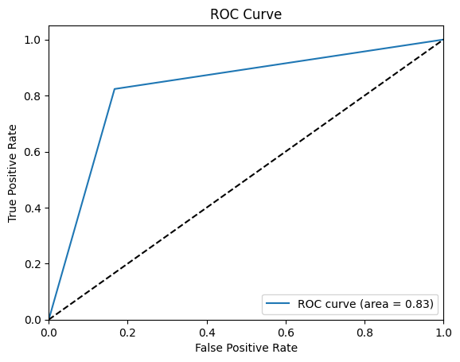

# Image Classification for ChestXray Gender Prediction

This repository uses the miniJSRT_database, which is a small dataset of Chest X-rays that can be used by beginners who would like to apply deep learning algorithms to a dataset. The dataset can ben found here: http://imgcom.jsrt.or.jp/minijsrtdb/

The aim of this project is to predict the gender of the image. To perform this task, the Gender dataset was used, which contains 247 pictures of males and females. Our of the 247 images available, 154 were used as part of the training dataset and 93 were used as part of the test dataset. Each picture is of size 256x256. A sample of a picture from each gender can be seen below.

The architecture used was Resnet18. I updated the number of output features of the final layer to have 2 output options, which are the 2 possible genders.

To train the model, I created data loaders of size 5 and I ran 100 epochs. That returned a very small value to the loss function during training. To check how well the predictions were, I used the test dataset and saw an accuracy of 0.83 and an AUC of 0.83 as well based on all test images. The model performed well with the dataset provided, even with little training. The ROC curve can be seen below:

## References
[1] http://db.jsrt.or.jp/eng.php

[2] http://imgcom.jsrt.or.jp/minijsrtdb/
